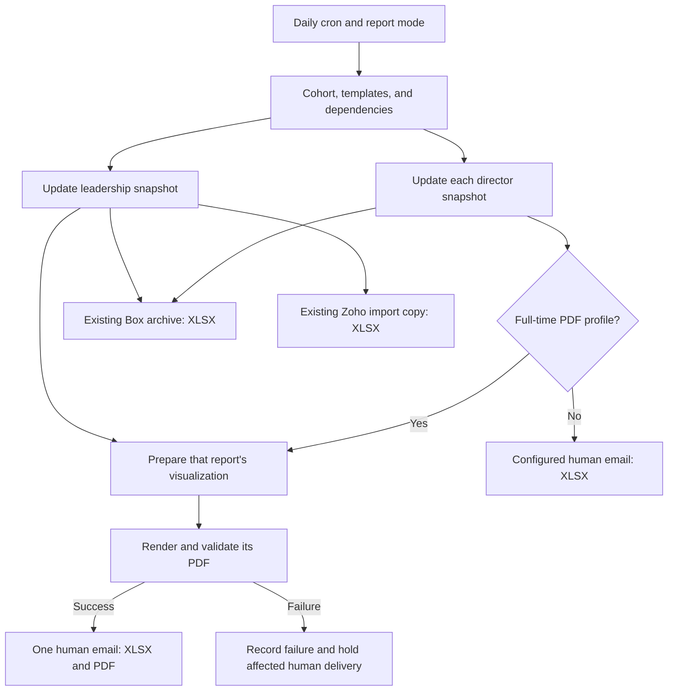

# 2027 Friday placement reports: implementation plan and agent handoff

Prepared September 23, 2026; revised after inspection of `June 26th Placement Dashboard.xlsx`. **Status: implementation completed and verified offline; target-Pi deployment and live delivery remain pending. See section 15 and the implementation package.**

The goal is to have the Raspberry Pi prepare the 2027 placement visualizations and attach them to the same Friday emails that deliver the placement workbooks. This includes copying report values into `NittyGrittySheet`, extending the weekly chart data, updating each page's current-month percentage, and exporting through the Excel-to-PDF rendering process. This document records the inspected behavior, intended changes, exact source anchors, and remaining deployment checks. During the initial planning review, no supplied source file, workbook, cron entry or GitHub file was modified and no production operation was run. Subsequent implementation was performed in a separate working copy; its actual status is recorded in section 15.

## 1. The main decision

Reuse the Excel-to-PDF rendering engine as a local Python component inside `PlacementRateReports`. Each report should finish its workbook updates, prepare the intended visualization pages, render and validate its PDF, and then assemble the email with the XLSX and PDF together.

**The visualization source is now identified and reconciled.** The supplied June dashboard contains 16 worksheets: `NittyGrittySheet` plus 15 presentation pages, with three native line charts per page, for 45 charts total. All 15 June 26 status blocks and rates match the same-date entries in the archived 2026 leadership report. All 15 current-month June percentages also match those weekly rates. Section 14 records the exact mappings and update rules.

The Excel-to-PDF app exports workbook content; it does not perform the manual report-to-dashboard copying. All 12 supplied production report workbooks for 2027 contain tables and no embedded charts. The new adapter must populate a separate 2027 dashboard from a completed report, then invoke the extracted renderer.

| Stage | Verified input | Required addition |
| --- | --- | --- |
| Weekly data and chart updates | Report history tables and the June `NittyGrittySheet` layout | Match observations by date/status, update or append each weekly point, and extend table/chart references and caches |
| Monthly percentage updates | Each dashboard's `M24:S38` comparison table | Update the current cohort's correct calendar-month cell, preserving older observations and marking a partial month accurately |
| 2027 initialization | June 2026 dashboard, existing 2027 report history, and historical comparison values | Create a separate 2027 dashboard; roll year headers and values together; retain provenance for incomplete historical months |
| Friday delivery | Existing report senders and Excel-to-PDF renderer | Render locally, validate the PDF, and attach it beside the matching XLSX |

The provided dashboard covers **full-time placement only**: overall MSB and 14 academic programs. It has no internship or Healthcare presentation pages. It supports one leadership PDF and ten non-Healthcare director PDFs using existing grouping. The 12 existing XLSX bundles remain; Healthcare retains its XLSX unless a separate visualization profile is defined. A representative final export would help check branding and visual fidelity, but the data mapping no longer depends on obtaining another template.

## 2. Evidence and source versions

| Source | Inspected identity | Interpretation |
| --- | --- | --- |
| Uploaded scripts | `49a56c16-7f11-4342-9741-18363857a889.zip` | Primary evidence for the Raspberry Pi project snapshot |
| Uploaded ZIP SHA-256 | `4727bdef830dc627d3665767d93a4a59ee4ced5e1961af6cddb277b06e6826aa` | Identifies the exact attachment |
| Git HEAD recorded inside the archive | `ddd8ddae22def7dbadf0a7b742f456b7519c4e5f` | A recorded revision, not proof that every archived working file matches that commit |
| Production project | `raspberryPI/PlacementRateReports/` | Selected by the supplied cron entry |
| Visualization app | [Carlosk12xd/Excel-to-PDF](https://github.com/Carlosk12xd/Excel-to-PDF) | Public source retrieved for this review |
| Inspected app commit | [`471bf7174d44a0ab08439128d4853096d0fbc693`](https://github.com/Carlosk12xd/Excel-to-PDF/tree/471bf7174d44a0ab08439128d4853096d0fbc693) | `main` at inspection; commit timestamp June 5, 2026, message `pdf or pptx` |
| App `app.py` SHA-256 | `19c53fccafa2581d153a334c8cbf2e82ff3d509333c07c6048d584253f5263a4` | 463 lines in the inspected version |
| Supplied visualization template | `June 26th Placement Dashboard.xlsx`, 454,198 bytes | Class of 2026 example, with weekly data through June 26, 2026 |
| Dashboard SHA-256 | `5441e0b2b4511884168cc34ef82ec46bcf66c1cb419ce03c7f60e7b6b940ca1a` | Exact unchanged attachment inspected for section 14 |

All Raspberry Pi source paths below are relative to `raspberryPI/`, unless explicitly stated otherwise. Line references identify individual anchors in this snapshot, not permanent locations. Future agents must reopen the named function and compare the file hash after changes.

This review did not inspect the running Pi, its installed crontab, its package versions, database contents, live environment variables, SMTP delivery, Box folder contents, or the deployed Streamlit app. Production report `.env` files were not present in the archive. The supplied 2027 leadership history ends August 21, 2026; the 2026 leadership history includes August 31, 2026. These archived dates do not establish the freshness of files currently on the Pi.

## 3. Current execution and delivery

### Scheduling and cohort selection

`crontab.txt`, line 61, runs the following module at **10:00 every day in the cron daemon's timezone**: `python3 -m core.daily_runner`. Its working directory is `/home/bccdatapi/raspberryPI/PlacementRateReports`, and it activates the virtual environment at `/home/bccdatapi/raspberryPI/raspberrypi/`.

The daily schedule is necessary for non-Friday month ends. `core/daily_runner.py` determines the report mode internally:

| Condition | Existing `a` flag | Current behavior |
| --- | --- | --- |
| Friday, not month-end | `0` | Weekly report and weekly Box destination |
| Month-end, not Friday | `1` | Month-end report and monthly Box destination |
| Friday and month-end | `2` | One month-end report and monthly Box destination |
| Neither | `None` | Exit without report generation |

Evidence: `PlacementRateReports/core/daily_runner.py`, lines 14, 17, 21, 25, and 30. The current runner is top-level executable code; importing it is not a safe test interface. It also imports report/email modules before the calendar check, and those modules read environment settings at import time.

The YAML is read at line 32. Cohort objects are constructed beginning at line 39, active cohorts are selected at line 60, leadership runs at line 70, and career-director reports run at line 74. `CohortManager.get_active_cohorts`, `core/cohort_manager.py` line 28, requires:

`enabled` and `start_date <= report_date <= grad_date + grace_days`.

The current configuration has both cohorts enabled and a 90-day grace period:

| Cohort | Start | Graduation boundary | Last active day, derived from configuration | Human email policy in code |
| --- | --- | --- | --- | --- |
| 2026 | June 23, 2025 | June 22, 2026 | September 20, 2026 | Allowed while the cohort is active |
| 2027 | June 22, 2026 | June 21, 2027 | September 19, 2027 | Explicitly skipped |

Consequently, **if the deployed Pi matches this snapshot**, the September 25, 2026 Friday run selects 2027 and generates/uploads reports but sends no human reports. Setting `enabled: true` again would not fix this: it is already true and does not control the two human-delivery exclusions.

`current_date_source` at `config/cohorts.yml` line 1 is not consumed by the inspected runner. Do not advertise it as an existing date override.

### Leadership flow

`LeadershipReport/email_overview_report.py`, `mainflow` at line 165:

1. Uses `cohort.overview_template` as the workbook path.
2. Calls `update_overall_report.main` at line 175.
3. Selects a weekly or monthly message at lines 177 and 180.
4. Opens Gmail SMTP over STARTTLS.
5. Sends the workbook to the configured cohort Box destination at line 194.
6. Sends an additional workbook copy to the `Zoho_Box` environment destination at line 195.
7. Sends the human message only when `cohort.id != "2027"`, at line 200.

Leadership recipients are drawn from `TO_ADDRS`, `CC_ADDRS`, and `BCC_ADDRS` environment values. Their actual live values are not available in this review. An existing documentation list of people is not a substitute for those settings.

The builder updates the same XLSX in place. It reads SQL results, refreshes current and history tables, updates the summary, appends missing `ZOHO_DATA` entries, and saves at `LeadershipReport/update_overall_report.py` line 862. The existing five-page description in email text is stale: the supplied leadership workbook has six worksheets, including the raw `ZOHO_DATA` sheet.

### Career-director flow

`ProgramReports/email_program_reports.py`, `mainflow` at line 152:

1. Builds the filename pattern at line 160: `{year}_Placement_Reports/{year}-WeeklyPlacement-{file_label}.xlsx`.
2. Opens and authenticates SMTP before the report loop, beginning at line 163.
3. Iterates the current `program_dict` at line 169.
4. Sets the global `OUTPUT_PATH` environment value at line 175.
5. For standard programs, updates aggregate tables and then placement details at lines 178 and 179.
6. For Healthcare, runs only the detail updater at line 181.
7. Builds the human message with one XLSX attachment at line 184.
8. Uploads the workbook to monthly Box for flags `1` and `2`, otherwise weekly Box.
9. Sends the human message only when `cohort.id != "2027"`, at line 196.

The current mapping is below. The names are source dictionary keys, not independently verified staff assignments. Preserve the recipient tuples until an explicitly requested routing change is verified.

| Dictionary key | Programs | 2027 workbook suffix after `2027-WeeklyPlacement-` |
| --- | --- | --- |
| Tracie | BSAcc, MAcc | `BSAcc-MAcc.xlsx` |
| Noelani | BSEDM | `BSEDM.xlsx` |
| Soraya | BSHRM, BSStrat | `BSHRM-BSStrat.xlsx` |
| Tanya | BSFin | `BSFin.xlsx` |
| Kurt | BSGSCM | `BSGSCM.xlsx` |
| Steven | BSEnt, BSBusM | `BSEnt-BSBusM.xlsx` |
| Bob | BSIS, MISM | `BSIS-MISM.xlsx` |
| Mike | BSMktg | `BSMktg.xlsx` |
| Perry | MBA | `MBA.xlsx` |
| Staci | MPA | `MPA.xlsx` |
| Erica | Healthcare | `Healthcare.xlsx` |

There are **11 career-director workbook bundles and one leadership bundle per active cohort**, not 14 separate director emails. Leadership covers 14 academic programs; some directors receive more than one program in their workbook.

### Existing Box and Zoho behavior

The four 2027 cohort Box addresses currently equal the corresponding 2026 addresses. The comment at `config/cohorts.yml` line 58 records that this was intentional after placeholder addresses were corrected. Do not invent new 2027 upload addresses or restore the example addresses from an older file.

Box uploads are sent by email. They are not Box API calls. The extra leadership `Zoho_Box` destination is a separate route and should retain its expected workbook payload.

`ZohoAnalytics/take_dashboard_screenshot.py` is a separate exporter, with defaults for 2026, BSFin, and Full Time at lines 55, 56, and 57. It is not called by the inspected placement runner. A sample PNG exists in that folder, but its presence does not establish a working, current 2027 visualization pipeline. Integrating that route would be a different design requiring its own freshness and schema checks.

## 4. Workbook and metric contracts

### Supplied 2027 workbooks

Read-only structural inspection confirmed that all 11 current program filenames exist and that their expected program sheets and named aggregate tables are present. Healthcare correctly has no aggregate named tables. No workbook was saved during inspection.

| Workbook kind | Observed structure | Consequence for rendering |
| --- | --- | --- |
| Leadership | `Summary - Full Time`, `Total - Full Time`, `By Program - Full Time`, `Total - Internships`, `By Program - Internships`, `ZOHO_DATA` | Explicitly select intended presentation pages; do not print the helper export sheet by default |
| Standard program | `2027 MSB Overall`, each program sheet, each program's `Placement Details` sheet | Create an explicit aggregate-page profile and keep detail sheets in the XLSX |
| BSFin | Overall sheet, finance sheet with six named tables, finance details | Preserve separate 2028 and 2029 internship sections |
| Healthcare | `Healthcare Full-Time`, `Healthcare Internships`, `Past Week Placement Details` | Needs its own layout; standard aggregate/placement-rate logic cannot be assumed |

All 12 inspected 2027 workbooks have zero embedded chart parts, zero embedded media files, and no explicit print areas. The leadership workbook's program sheets extend to rows 431 and 404. `ZOHO_DATA` extends to row 3425. Fitting any of those whole sheets onto one slide would be unreadable; rendering all visible sheets as-is can create excessive pages.

The summary sheet has ten formula cells with empty stored calculation caches. A cached-value-only reader must not interpret those cells as valid zeros. Confirm recalculation in the target rendering engine and validate the resulting summary totals.

The archive also contains pre-cohort history labels from March and April 2026 inside 2027 workbooks. Their provenance is unverified. Chart preparation must not silently present those observations as legitimate 2027 tracking history. Use the configured start boundary for a proposed display filter and document it; do not erase the original history as part of this integration.

### Existing named-table rules

| Area | Required names or rule | Source anchors |
| --- | --- | --- |
| Leadership summary | `summary`, current extent `A2:K17` | `update_overall_report.py` lines 63 and 677 |
| Leadership totals | `FT_total_mrf`, `FT_total_wh`, `INT_total_mrf`, `INT_total_wh` | Same file, lines 64, 65, 66, 67 |
| Leadership FT per program | `{program}1` and `{program}2`; MBA/MPA insert `_` | `byprog_full_names`, line 92 |
| Leadership internship per program | `{program}_int1`, `{program}_int2` | `byprog_int_names`, line 99 |
| Program overall | `Class1`, `Class2`, `Class3`, `Class4` | `create_program_reports.py`, line 56 |
| Standard program | Four tables: current FT, history FT, current internship, history internship | `table_names`, line 49; `update_sheet_with_ft_int`, line 380 |
| Program MBA/MPA | `{program}_1` through `{program}_4` | `create_program_reports.py`, line 59 |
| BSFin | `BSFin1` through `BSFin6` | Same file, line 61; `update_bsfin_with_ft_int`, line 394 |

The workbook layout is an API used by the scripts. A visualization preparation step should work on its own copy or dedicated presentation workbook; it must not rename or delete the tables consumed by the existing updater.

### Metric meanings to preserve

Current placement rate is:

`Accepted an offer / (Accepted an offer + Actively seeking + Not Reported)`.

`No Recent Information Available` is a separate category excluded from that denominator. Not-seeking categories also do not belong in that denominator. Class Size is a different measure. A zero denominator currently returns a zero rate. Changing that display or business rule needs an explicit decision, not an incidental visualization rewrite.

Sources: leadership `placement_percent` at line 224 and summary notes at line 683; program `placement_percent` at line 216 and `compute_totals_and_percent` at line 340. Overall percentage must be pooled from counts, not averaged across program percentages.

The leadership summary adds the empty-string status to `Not Reported` at line 635, while other table calculations look up the exact `Not Reported` label. The comment claiming universal agreement does not prove agreement when blank statuses occur. Include that case in reconciliation and settle the normalization rule explicitly if it appears in real data.

For 2027:

- Full-time aggregates include enrolled/graduated Class of 2027 students and enrolled students from 2026 and 2025, subject to the existing record/program/semester filters.
- General internship aggregates use 2028, 2029, and 2030 from the cohort YAML.
- Finance's specialized internship aggregates use 2028 and 2029 separately.
- General internship placement details currently use 2027 through 2030. Those details are not the same population as the aggregate internship denominator.
- Recent detail queries use `NOW() - INTERVAL 7 DAY`. Their time window is independent of a Python filename/date label.
- Healthcare cumulative queries use the August-to-July year window in SQL. The internship query accepts cohort start/end arguments but currently does not use them in its returned SQL.

Sources: `LeadershipReport/sql_queries.py` lines 26 and 43; `ProgramReports/cd_sql_queries.py` lines 18, 127, 162, 221, 292, 298, 325, and 334. Do not rewrite these populations merely to make every chart or detail count equal.

`ZOHO_DATA` stores `Program`, `Type`, `Status`, `Date`, and `Count`. Its export is append-only for existing keys: `append_zoho_history_rows` skips a matching key at line 527. A same-day correction to a report table does not overwrite an existing exported count. Therefore use the freshly validated workbook tables as the initial visualization source, or separately fix and test this export behavior before using `ZOHO_DATA` as the sole current source. Missing exported rows also must not become invented historical zero observations.

## 5. What to reuse from Excel-to-PDF

The inspected [app source](https://github.com/Carlosk12xd/Excel-to-PDF/blob/471bf7174d44a0ab08439128d4853096d0fbc693/app.py) performs these operations:

| Function or block | Anchor line | Existing responsibility | Integration treatment |
| --- | --- | --- | --- |
| `find_soffice` | 39 | Locate LibreOffice | Reuse with deployment validation |
| `save_upload` | 53 | Read a Streamlit upload buffer | Replace with an ordinary local path interface |
| `get_sheet_names_from_upload` | 64 | Read sheet names through an uploaded buffer | Replace with a path-based read |
| `prepare_workbook_for_rendering` | 78 | Hide excluded sheets, infer print areas from cells, force one page per sheet | Adapt to explicit profiles and chart bounds; operate on copies |
| `convert_to_pdf` | 114 | Run headless LibreOffice with a 300-second subprocess timeout | Reuse, add isolated profile, strict output validation, and structured errors |
| `pdf_to_images_poppler` | 129 | Render PDF pages into PNGs using `pdftoppm` | Reuse if retaining the branded screenshot appearance |
| `crop_white_space`, `resize_for_page` | 142, 159 | Crop and resize screenshots | Preserve agreed settings and test thin/light chart elements |
| Logo and font helpers | 168, 179 | Prepare logo, locate fonts | Resolve assets relative to the module and verify Pi fonts |
| `make_intro_page`, `extract_intro_page` | 207, 220 | Create a cover or reuse a supplied PPTX cover | Make the title and optional template explicit configuration |
| `make_sheet_page` | 228 | Place content on a branded 1920-by-1080 page | Reuse the desired visual style |
| `build_pdf` | 259 | Save the composed pages as an image-based PDF | Primary proposed output |
| `build_powerpoint` | 265 | Put page screenshots on slides | Optional later format; the slides do not contain editable native charts |
| `convert_excel_to_export` | 296 | Coordinate uploaded input, conversion, wrapping, and output bytes | Refactor into a non-UI function returning stable artifact paths/metadata |
| Streamlit `main` | 384 | Widgets, uploads, download buttons | Not part of the Pi's scheduled execution |

The app's normal pipeline is workbook → LibreOffice PDF → Poppler screenshots → cropping/resizing → cover and sidebar composition → final PDF or PPTX. Reusing only LibreOffice would omit the app's cover and branded wrapper. That could be an intentional simpler format, but it is not visual parity with the app's final output.

The app's pure path, at line 332, is used only when all sheets remain in their original selection/order. A subset uses an `openpyxl`-saved copy. That distinction matters for chart preservation. The current fallback infers bounds only from nonempty cells, so charts extending outside those cells can be clipped. It also traverses sheets in workbook order, rather than enforcing a requested reordered list.

The page label at line 365 assumes page index corresponds to sheet index. A multi-page worksheet breaks that association. The automated renderer must either guarantee one intentional page per presentation sheet or render sheets/ranges separately and retain their page mapping. Do not relabel pages merely by their index in a combined PDF.

The app uses a temporary directory and returns file bytes at line 381. A Pi integration must persist the final artifact before that directory is removed. Its default logo path at line 16 is relative to the current working directory; porting it unchanged into the report project would point at the wrong location.

The repository declares Streamlit, `openpyxl`, Pillow, and `python-pptx` in `requirements.txt`, and LibreOffice plus Poppler in `packages.txt`. For a PDF-only extracted module, Streamlit can be omitted, and `python-pptx` can be omitted if its imports/export branch are removed or made optional. An optional intro PPTX still requires LibreOffice's ability to render that input. Preserve the tested behavior rather than installing the entire UI app on the Pi.

## 6. Proposed design and operating policy

**This section records the original design proposal. Section 15 and the implementation package document which components now exist and where the implementation differs.**

### Report lifecycle

The visualization stage must consume the same completed workbook snapshot that is attached to that email. It must not query SQL again. The existing builders query data at different moments, so this guarantees consistency within a report bundle; it does not claim a single database-wide snapshot across all 12 reports. Update a persistent overall dashboard from the leadership snapshot. Build each director's isolated presentation copy from that director's completed XLSX, using `Class2` for overall full-time history and its program history tables for the owned pages. Do not assume a later director query necessarily matches an earlier leadership query. Healthcare follows its configured XLSX-only route.

Use a run directory keyed by cohort, actual report date, mode, and report/group identifier. Preserve a validated snapshot and its manifest for a render/delivery retry. Do not reuse an arbitrary `latest.pdf`, search a shared directory for the first PDF, or label a previous file with today's date.

A practical staged approach is:

1. Copy the rolling workbook to a run-specific staging path.
2. Update that copy through explicit path arguments and validate the XLSX contract.
3. Preserve the valid updated workbook as the report snapshot and promote its history to the rolling workbook with an atomic replacement and a recovery copy.
4. Prepare and render the visualization from the same snapshot.
5. Build delivery messages from a validated artifact record.
6. On rendering failure, retain the snapshot for retry, continue the existing valid XLSX archive routes, and hold that report's new PDF-required human message. Other report bundles may proceed.

History persistence and delivery are separate states: an updated workbook does not prove its email was sent. Retrying rendering must not requery live data or append history again. The existing same-day guard only recognizes the rightmost date column; it is not a complete historical replay facility.

### Delivery defaults for this request

| Channel or condition | Proposed first release |
| --- | --- |
| 2027 Friday, flag `0` | Human XLSX + validated PDF for supported full-time profiles, after rollout activation; Healthcare XLSX only |
| 2027 Friday/month-end, flag `2` | One month-end human email with the same profile-specific attachments; no duplicate weekly message |
| 2027 non-Friday month-end, flag `1` | Preserve existing generation/Box behavior; human/PDF expansion requires a separate scope decision |
| Ordinary Box destinations | Preserve existing XLSX uploads initially; optional PDF archival is a separate setting |
| Leadership `Zoho_Box` | Preserve the XLSX-only import payload |
| PDF failure | No stale PDF and no success claim; hold affected PDF-required human delivery and log a recoverable failure |
| Healthcare without a visualization profile | Continue the configured XLSX delivery; absence of an unsupported PDF is not a rendering failure |
| 2026 | Preserve its configured tracking boundary; do not extend tracking as a side effect of enabling 2027 |
| Optional PPTX or inline images | Later format choices, not prerequisites for the PDF integration |

Generation eligibility, human delivery, visualization generation, and archive destinations should be distinct settings. A cohort's `enabled` flag should continue to mean “eligible for tracking.” Add an explicit human-delivery policy by report mode and a visualization profile. New fields must be added to YAML parsing and the dataclass together. Avoid a single boolean that accidentally enables non-Friday 2027 human emails when the requested change is Friday delivery.

### Minimal reusable components

| Proposed new path inside `PlacementRateReports/` | Responsibility |
| --- | --- |
| `Visualization/render_excel.py` | Path-based renderer extracted from the pinned app; no Streamlit, SQL, or SMTP |
| `Visualization/build_visualization.py` | Select a report's pages, coordinate the dashboard adapter and renderer, and return validated artifacts |
| `Visualization/update_dashboard.py` | Read completed report tables, initialize/update the 2027 dashboard, maintain weekly references/caches and monthly cells, and validate the mappings in section 14 |
| `Visualization/assets/default_logo.png` | Reviewed branding asset copied from the app if that logo is the intended branding |
| `Visualization/templates/placement_dashboard_template.xlsx` | Versioned layout derived from the supplied June dashboard; original attachment remains unchanged |
| `Visualization/Dashboards/2027_placement_dashboard.xlsx` | Proposed persistent 2027 presentation history, distinct from the immutable layout and per-run render copies; location must be deployment-configurable |
| `config/visualizations.yml` | Explicit profiles and validated mappings: source tables, dashboard rows, monthly cycle, included sheets/ranges, order, title, format, DPI, cover, print layout, page limits |
| `core/report_artifacts.py` | Report identity, run directory, XLSX/PDF paths, hashes, validation result, and delivery state |
| `core/delivery.py` | Shared attachment construction and transport policy, including a no-send path for saved email previews |
| `tests/` | Focused tests for calendar policy, artifact matching, special program layouts, conversion failure, and retry behavior |

Suggested renderer contract: local input workbook path, explicit output PDF path, rendering profile, and report context in; validated artifact paths and page metadata out. Suggested context fields: cohort ID, report date, run timestamp/timezone, report mode, audience/program group, and run ID. Names are illustrative until implementation is approved.

Rendering should initially run sequentially on the Pi. Open SMTP only when the artifacts are ready; do not keep a connection idle while LibreOffice works through many reports. Give each conversion its own writable LibreOffice profile and work directory, and prevent overlapping full report runs.

LibreOffice officially supports `--headless`, `--convert-to`, `--outdir`, and a separate `-env:UserInstallation` profile. Its profile directory must be writable. See the [official command-line documentation](https://help.libreoffice.org/latest/en-US/text/shared/guide/start_parameters.html). The exact OS packages, Python version, memory budget, conversion timeout, and attachment-size limit must be measured/confirmed on the Pi. The inspected app's type syntax requires Python 3.10 or newer if copied unchanged.

A report beginning at 10:00 will send after generation and rendering complete. If “in inboxes by 10:00” is a requirement, schedule preparation earlier after measuring the workload; do not silently claim the current cron time guarantees a delivery deadline.

## 7. Exact existing files and change anchors

The following are planned edit targets. “Anchor” is a current line number plus symbol/behavior. New lines cannot be numbered until the patch exists.

| Existing file | Current anchors | Planned behavior |
| --- | --- | --- |
| `crontab.txt` | 61: placement runner | Keep the daily schedule. Add an overlap lock/log routing only after confirming the real installed entry and chosen runtime paths. Never add a second sending job. |
| `PlacementRateReports/core/daily_runner.py` | 6, 7: email imports; 14: date; 21: mode; 32: YAML; 39: object; 70, 74: flows | Add a callable entry point and shared run context; parse new policy/profile fields; resolve paths from the project root; preflight all required workbooks; provide explicit render-only and no-send modes. Gate imports so offline rendering does not require DB/SMTP credentials. Report actual outcomes. |
| `PlacementRateReports/core/cohort_manager.py` | 5: `Cohort`; 18: `enabled`; 28: active filter | Carry new delivery/profile fields while preserving inclusive date eligibility. Do not reinterpret `enabled` as permission to email. |
| `PlacementRateReports/config/cohorts.yml` | 45: 2027 block; 49: internship years; 53: workbook; 61: Box routing; 65: enabled; 68: grace | Add explicit 2027 Friday delivery/visualization settings. Retain the verified source-year filters and existing destinations unless intentionally changed. Keep test/offline policy separate. |
| `PlacementRateReports/LeadershipReport/email_overview_report.py` | 13: unused import; 47, 82: builders; 66, 102: fixed 2026 text; 110: later-visualization promise; 129: attachment helper; 175: workbook build; 188: SMTP; 194, 195: archives; 200: 2027 exclusion | Remove the unused Matplotlib import; attach a validated artifact list; insert visualization preparation/rendering after the completed workbook; make the body cohort-aware; replace the hard-coded year exclusion with explicit policy. Keep a separate workbook-only Zoho message. Only describe an attached visualization when it exists for that mode. |
| `PlacementRateReports/ProgramReports/email_program_reports.py` | 36: mapping; 102: message; 116: Box; 126: attachment; 153, 155: settings checks; 160: filename; 163: SMTP; 175: output path; 178, 179, 181: builders; 183: message; 185: archive route; 196: exclusion | Prepare each report before connecting SMTP. Render supported full-time profiles only after both aggregate and detail saves. Pass an explicit path and report context. Attach XLSX/PDF from the same report record, preserve grouping/envelopes, and use configurable Friday delivery. Healthcare remains XLSX-only without an additional profile. Validate actual configured destinations instead of the unused `BOX_UPLOAD_EMAIL` setting once callers are migrated. |
| `PlacementRateReports/ProgramReports/email_templates.py` | 3, 18: ordinary bodies; 13: future promise; 33, 45: Healthcare bodies; 57: dispatch; 62, 68: unconditional overwrite | Make message text reflect its actual attachments. Fix Healthcare dispatch with exclusive branches/early returns. Preserve non-Friday month-end wording until its visualization workflow is actually implemented. |
| `PlacementRateReports/LeadershipReport/update_overall_report.py` | 42, 43: global date; 224: rate; 311: history update; 486: export append; 599: summary; 770: entry; 819: load; 856: Zoho; 862: save | Accept the explicit run date and staged workbook path; return the completed artifact path. Preserve metric/table contracts and existing history guards. Keep presentation-only print changes outside the rolling data workbook. If Zoho corrections are pursued, treat them as a separate, tested data-contract change. |
| `PlacementRateReports/ProgramReports/create_program_reports.py` | 32: global date; 49: table mapping; 216: rate; 287: history; 394: Finance; 414: entry; 469: path fallback; 497: save | Accept explicit path/date and return the saved path. Preserve table metadata synchronization and current same-day reuse. Use the actual year-prefixed filename convention. Rename misleading Finance variable labels if editing that interface, while preserving the two cohort meanings. |
| `PlacementRateReports/ProgramReports/placement_details.py` | 18: layouts; 90: entry; 100, 101: years; 131: path; 145, 148, 149: Finance routes; 151: Healthcare; 180: save | Accept explicit output path. Correct line 149 to use the second internship year's result for the second section. Return the final workbook path; render after this save. Preserve Healthcare's three-sheet layout. |
| `PlacementRateReports/ProgramReports/cd_sql_queries.py` | 162, 188, 216, 242, 267: `NOW()` windows; 298: Healthcare cumulative query | No SQL rewrite is required merely to render PDFs. If adding an explicit run-time window, parameterize bounds and pass them through all affected callers. A backdated label must not be sold as a historical database reconstruction. |
| `PlacementRateReports/LeadershipReport/sql_queries.py` | 2: summary; 26: FT; 43: internships | Preserve existing populations for the initial integration. Reconcile blank-status behavior separately if the validation case demonstrates a mismatch. |
| `PlacementRateReports/requirements.txt` | 4, 7: current dependency list | Add only the extracted renderer's required libraries, including Pillow; add PPTX support only if retained. Pin tested compatible versions during deployment preparation. |
| Root `requirements.txt` | 10: combined dependency list begins | Keep the combined installation path consistent with placement-specific requirements. Remove reliance on an undeclared unused Matplotlib import. |
| `PlacementRateReports/LeadershipReport/Reports/2027_weekly_placement_report.xlsx` | Worksheet/table contracts in section 4 | Treat as a rolling data workbook. Preserve history and schema. Test print/layout preparation on copies or a dedicated visualization workbook. |
| `PlacementRateReports/ProgramReports/2027_Placement_Reports/*.xlsx` | Exact 11 filenames in section 3 | Preserve program grouping and year labels. Read full-time history into separate dashboard copies using section 14; leave report schemas intact. |
| `PlacementRateReports/DOCUMENTATION.md` | 17: delivery; 54: no dry-run; 263: leadership; 319: programs; 476: inaccurate fallback warning; 536: 2027 skip | Update to match implemented behavior, interfaces, dependencies, policy, tests, and rollback. Correct the inaccurate fallback explanation. Do not mark planned features implemented. |
| `PlacementRateReports/README.md` | 63: new-cohort setup; 67: Box templates; 78, 80: old path names | Point to canonical paths and the implemented visualization workflow. Distinguish report templates from the separate dashboard template and describe annual rollover. |

No initial edits are needed in `BCCRobot`, `Quinncia`, `ZohoCRM`, `Deprecated`, or the standalone Zoho screenshot workflow. Do not implement the integration in `PlacementRateReports-TESTING` and assume production will use it. The supplied cron points to `PlacementRateReports`.

For the app repository itself, an initial integration can extract and attribute the pinned rendering functions without modifying the live Streamlit app. A shared package consumed by both projects is a later maintenance improvement. Do not fetch changing GitHub `main` during a scheduled Friday run.

## 8. Known issues to carry into the implementation

| Finding | Evidence | Treatment |
| --- | --- | --- |
| 2027 human messages are suppressed in both flows | Leadership line 200; program line 196 | Required policy change for this goal |
| Data reports and visualization workbook are separate | Production 2026/2027 report files have no chart parts; the June dashboard contains 45 charts | Use the section 14 adapter to connect the two; template discovery is complete |
| Weekly charts have fixed endpoints | June dashboard series end at `AL`; 37 weekly observations | Extend chart categories, values, caches, and the 30 weekly tables together |
| Monthly table says end-of-month but contains June 26 rates | `M23` versus `N35` on all 15 pages | Label the current month as provisional/as of the report date; explicitly define finalization |
| Monthly axis contains two Augusts and two Septembers | Rows 25/26 and 37/38 | Resolve by cohort year and calendar year/month, never month text alone |
| Chart anchors extend beyond populated cells | Dashboard dimension `B1:S38`; drawings extend into `T39` | Start with explicit `B1:T39` print profiles and validate final output |
| Finance repeats the first internship year's detail rows in the second section | `placement_details.py` line 149, compared with line 146 | Small correctness fix before distributing 2027 Finance reports; verify with distinct 2028/2029 fixtures |
| Healthcare-specific bodies are overwritten | `email_templates.py` lines 62 and 68 follow the special branches | Correct alongside attachment-aware email text |
| Summary formula caches are empty | `Summary - Full Time`, 10 formula cells | Validate recalculated output; do not read missing caches as zeros |
| Leadership raw helper data is visible and very long | `ZOHO_DATA`, 3425 rows in supplied 2027 workbook | Exclude from visual output through an explicit rendering profile |
| App uses unsafe page-to-sheet labeling for multi-page sheets | App line 365 | Preserve actual mapping or generate bounded presentation pages |
| Production modules read settings at import; runner executes at import | Runner line 6; updater configuration blocks | Establish an offline renderer/no-send entry point that does not require live credentials |
| Program SMTP opens before all generation | Program sender line 163 | Move transport after artifact preparation |
| An exception currently interrupts remaining work | Runner calls and sender loop have no report-level isolation | Preflight early, record bundle-level failure, preserve successful artifacts for controlled retry |
| Re-running a sender can send duplicate messages | No delivery ledger in the inspected flow | Record delivery state; use explicit resend/retry semantics |
| Existing docs claim a `file_label` NameError that the source does not have | `DOCUMENTATION.md` line 476 versus builder line 469 and details line 131 | Correct the docs: the placeholder is a literal formatted later; the real fallback issue is its missing `{year}-` filename prefix |
| The testing folder can send real email | Testing runner line 79; testing leadership sender line 205 | Do not use it as a no-send harness |

SMTP acceptance is not an exactly-once delivery guarantee. A disconnect after submission can leave the delivery state uncertain. Record that uncertainty and require an explicit resend decision instead of blindly repeating every recipient. Do not claim a local JSON ledger eliminates every duplicate-email possibility.

## 9. Implementation sequence and completion gates

### Step 1 — retain the verified template and establish the runtime baseline

Template discovery and June reconciliation are complete. Use the supplied dashboard and section 14 mappings as the baseline. Record the team's actual cover/logo/export settings; a representative final PDF is useful for comparison but is not a prerequisite for implementing the data adapter. Identify any later 2026 month-end snapshots needed to complete that historical comparison series; absent values remain unknown until sourced.

On the Pi, inspect the live revision/worktree, installed crontab, Python version, OS/architecture, available memory/storage, LibreOffice/Poppler/font availability, timezone, and environment-key presence without exposing values. Compare the production files to this document's hashes. Verify recipients and Box routes from the deployed configuration when a sending rollout is actually requested.

**Gate:** template identity and mappings are retained, historical gaps are identified, and deployment differences are recorded. No running-Pi compatibility or final visual-parity claim is made from file inspection alone.

### Step 2 — extract the renderer without touching delivery

Create the new path-based rendering component from the pinned app. Preserve agreed visual settings, eliminate Streamlit upload/widget dependencies, fix asset resolution, give LibreOffice an isolated profile, and require the exact expected output file. Keep conversion output, stderr, page count, timing, and size in the run record.

Create explicit presentation page profiles. Avoid squeezing hundreds of rows onto one page. Render a copied representative workbook offline and compare the final wrapped PDF to the reference. The app's defaults are 190 DPI, whitespace cropping enabled, sheet labels enabled, and a generated cover unless a custom cover is supplied; confirm whether those are the team's actual settings.

**Gate:** a local renderer produces the reviewed visual format without database access, SMTP credentials, uploads, or edits to the original workbook.

### Step 3 — automate visualization preparation

Implement `Visualization/update_dashboard.py` using section 14. Initialize 2027 without relabeling 2026 observations as new-year data. Map source dates/statuses into the 15 weekly blocks, update the correct monthly cells, synchronize weekly tables and chart references/caches, set page order/print areas, and verify recalculated rendering. Keep source data and presentation layout separate.

Cover leadership and the ten non-Healthcare director groups, including paired pages. This supplied template contains a Finance full-time page; its internship sections remain in the report XLSX. Healthcare retains its three-sheet XLSX. New internship/Healthcare dashboard designs require their own mapping and are outside the supplied template's coverage. Resolve the pre-cohort history display rule and monthly finalization policy without changing the placement denominator.

**Gate:** chart values reconcile to the same report snapshot and the approved reference appearance. The process requires no manual app upload or workbook preparation.

### Step 4 — add report context, staging, and offline/no-send execution

Introduce explicit paths/date context and artifact records. Preserve rolling history while creating durable per-run snapshots. Add a render-only command and a dry-run that saves email packets locally. A true dry-run must suppress all SMTP delivery, including Box and Zoho email uploads, and must use staged workbook copies. Distinguish database-backed dry-run from fully offline fixture rendering.

Add preflight checks for every active report's file, required sheets/tables, configured profile, output directory, and rendering dependencies. Preserve calendar/cohort rules. Fix Finance row routing and Healthcare body selection in isolated, reviewable changes.

**Gate:** a full 2027 run can prepare all required artifacts and `.eml` previews without sending anything or overwriting live workbooks.

### Step 5 — integrate leadership first

Render after `create_reports` completes and before building the human email. Add the PDF to the attachment list. Retain separate workbook-only Box/Zoho messages. Make the cohort/year and attachment description accurate. Replace the hard-coded exclusion with the explicit mode-aware delivery policy while initially keeping production sending off for the pilot.

**Gate:** the preview contains the correct leadership workbook and matching PDF, and the archive previews preserve their expected payloads.

### Step 6 — integrate all career-director groups

Render supported full-time profiles only after `add_placement_details` saves the final report. Use the dictionary's exact group label to resolve profiles and filenames. Prepare messages before opening SMTP. Ensure that each supported group's PDF and XLSX share a run ID, cohort, and group, and that an artifact from the previous iteration cannot be reused accidentally. Healthcare receives its configured XLSX without requiring a nonexistent PDF profile.

**Gate:** all 11 director groups have the correct artifact/recipient mapping: ten with full-time PDFs and Healthcare with its XLSX. Together with leadership, that is 12 XLSX bundles and 11 supported PDF bundles. A rendering failure does not produce another group's attachment or a false success log.

### Step 7 — validate on the target Pi

Run offline fixtures and then a staged database-backed dry-run under the same user/environment as cron. Benchmark the entire 12-bundle workload sequentially. Inspect representative final pages, serialized email sizes, formula outputs, logs, and retry records. Confirm no output is truncated, mislabeled, stale, or too large for the agreed mail transport limit.

**Gate:** the acceptance matrix below passes, and any remaining deviation is recorded. No claims about Pi performance or Microsoft Excel visual fidelity should precede this check.

### Step 8 — activate delivery and record the new baseline

Once the implementation is reviewed and a sending rollout is authorized, perform a controlled pilot to a verified test destination, then activate 2027 Friday modes for the existing recipient configuration. Keep one scheduled runner. Record the deployed revision, profile/template versions, installed dependencies, first successful run, known limitations, and rollback procedure.

**Gate:** the deployed job produces the visualization and sends it with the intended Friday email; the work no longer requires separate app processing. Update documentation and source hashes in the same change.

## 10. Acceptance matrix

These are required future checks, not tests claimed to have run during this planning review.

| Case | Required evidence |
| --- | --- |
| Ordinary Friday: September 25, 2026 | 2027 selected by the supplied dates; weekly policy; one human message per intended bundle after activation |
| Non-Friday month-end: September 30, 2026 | Monthly archive behavior preserved; proposed Friday-only human setting does not accidentally send |
| Friday month-end: April 30, 2027 | One monthly message per bundle with its configured attachments; PDF for supported full-time profiles; no duplicate weekly email |
| Ordinary weekday | No report side effects; entry point returns cleanly |
| Cohort boundary | Inclusive last active day; 2026 excluded after September 20, 2026; do not require manual disablement |
| Standard and paired groups | Correct individual program sheets, artifact names, and envelopes |
| Finance | Clearly different 2028/2029 fixture rows appear in their corresponding XLSX details; full-time dashboard uses `BSFin2` and introduces no internship chart claims |
| Healthcare | No request for standard `Class1` tables or an undefined PDF profile; correct three-sheet path/body and configured XLSX delivery; no fabricated denominator |
| Metric reconciliation | Exact count agreement with source snapshot; pooled percentage; `Not Reported` and `No Info` handled according to the current contract; blank-status case checked |
| Formula evaluation | Leadership total formulas are evaluated in the target renderer and match independent totals |
| History | No duplicate latest-date columns on same-day retry; no deletion of existing history; pre-cohort history handling documented |
| June dashboard fixture | All 15 June 26 status blocks, rates, and monthly `N35` values match the archived 2026 report |
| Weekly dashboard append | Next date extends every applicable table, chart category/value reference, and cache; same-date rerun updates that date instead of duplicating it |
| Monthly cycle | September 2026 maps to row 26 for class 2027; September 2027 maps to row 38; June/July 2026 never enter rows 35/36 |
| Annual rollover | Headers and historical values shift together; 2027 weekly data replaces template cohort data only in the new copy; unknown historical months stay blank |
| Current versus closed month | Weekly updates modify only the applicable current-month cell; any final month-end update uses an actual archived/generated snapshot and its date |
| Chart preservation | 45 chart objects and intended styles/labels survive preparation; hidden helper-sheet data remains visible in charts; future-month blanks remain gaps |
| Same-day corrections | Verify visualization source values; explicitly check append-only `ZOHO_DATA` does not masquerade as refreshed data |
| Long sheets/multi-page output | No helper-sheet dump, unreadable one-page shrink, clipped chart bounds, or incorrect sheet label |
| Missing converter/font/template | Clear failed artifact state before human send; no stale PDF fallback |
| Conversion timeout/corrupt PDF | Affected delivery held; successful report records retained; retry uses its saved snapshot |
| Email construction | Expected XLSX/PDF MIME types, filenames, cohort/date/group, and all intended envelope recipients; no cross-group attachments |
| Dry-run | Zero SMTP calls, including all Box/Zoho routes; no production workbook overwrite |
| Delivery retry | Already confirmed sends skipped; ambiguous submission recorded for review; no blanket resend |
| Pi resources | Entire workload fits memory, disk, elapsed-time, and serialized-message-size budgets with recorded versions |

## 11. Rollback and future-agent operating record

Before the first implementation deployment, record a recovery copy of source/configuration and rolling workbooks. A renderer rollback should be possible through a visualization feature setting without deleting valid placement history. Decide explicitly whether rollback means XLSX-only human delivery or holding the new 2027 human messages; do not let an exception choose that policy silently.

Do not restore old workbooks casually: that would remove history accumulated after the backup. If schema changes require paired source/workbook restoration, identify the exact compatible pair and the history impact. Existing July backup files are historical recovery material, not the newest production implementation.

Maintain three small documents in the project once implementation is authorized:

- `AGENTS.md`: entry point, scope, source-of-truth files, no-send workflow, workbook/metric rules, and links to the detailed documentation. This is a proposed future file, not an instruction file created by this review.
- `DOCUMENTATION.md`: actual current architecture, command interfaces, dependencies, rendering profiles, delivery policy, recovery, and unresolved limitations.
- `CHANGELOG.md` or a dated change note: what changed, why, exact files/symbols, validation performed, deployment status, and any decisions still open.

After every meaningful patch, refresh the following record:

| Record | What it must contain |
| --- | --- |
| Source baseline | Production commit/worktree status, renderer source commit, relevant file hashes, template/profile versions |
| Implemented behavior | What actually exists and is connected to the production entry point |
| Planned behavior | Unimplemented work clearly separated from completed work |
| Evidence | Tests performed, input fixtures, observed outputs, and tests not run |
| Runtime | Pi architecture/OS, Python/LibreOffice/Poppler versions, timezone, and relevant resource limits |
| Delivery | Enabled cohorts/modes, destination configuration source, and pilot/production status |
| Open decisions | Actual export/cover settings, current-month versus final month-end policy, availability of later 2026 history, Healthcare/internship presentation expansion, PDF archive policy |

### Copyable handoff for the next agent

> Work on the production `raspberryPI/PlacementRateReports` pipeline selected by `crontab.txt` line 61. This document is a planning baseline, not proof of implementation. Reopen source and compare hashes before editing. The supplied snapshot generates 2027 XLSX reports but suppresses human sends in both email modules. Class of 2026 expires September 20, 2026 under the supplied configuration. The Excel-to-PDF source inspected was commit `471bf7174d44a0ab08439128d4853096d0fbc693`; it renders workbook content and does not copy report data into charts. The separate `June 26th Placement Dashboard.xlsx` is now inspected: 16 sheets, 15 full-time dashboard pages, 45 charts; all 15 June 26 status blocks/rates reconcile to the 2026 report. Follow section 14 for exact weekly rows, monthly cells, chart references/caches, year rollover, and date mapping. Current-month cells are manually populated snapshots, not formulas or independent slide text. The monthly axis repeats August and September across two calendar years. Preserve 11 director groups, named-table contracts, denominator, Finance's 2028/2029 XLSX split, Healthcare layout, routing, and workbook-only Zoho import. This template supports leadership plus ten director PDFs; Healthcare remains XLSX-only unless its scope is expanded. Render each supported PDF from the same completed XLSX attached to its email. Do not run the production runner or testing sender as a smoke test. No-send execution must avoid every SMTP route and live workbook write. All proposed modules/configuration/CLI options remain unimplemented until verified in code. Update documentation, hashes, validation evidence, remaining work, and deployment status after changes. The original instruction was to establish the plan before changing code; this document records that plan and does not represent a completed implementation or deployment.

## 12. What was verified during this review

- Read the production scheduling, configuration, cohort selection, leadership/program senders, builders, detail writer, SQL builders, and relevant documentation.
- Retrieved and inspected the application's pinned source, dependency files, and default asset inventory.
- Inspected the 12 production 2027 workbook structures without editing them, including sheets, named tables, chart/media presence, print settings, history labels, and formula-cache presence.
- Checked the 11 program filenames and expected sheet/table names against the current dictionary; no missing expected program sheets/tables were found in those supplied files.
- Checked all 24 current production 2026/2027 XLSX files for chart parts; none were found.
- Inspected the supplied June visualization workbook: 16 worksheets, 45 native line charts, 51 named tables, drawing bounds, cell formulas, chart references/caches, and monthly comparison values.
- Reconciled all 15 June 26 weekly blocks against the same-date 2026 leadership history: all 11 status/count rows per block and all placement rates match. Each page's monthly `N35` matches its weekly rate.
- Confirmed the two weekly charts per page use fixed endpoints at `AL`; monthly charts use each page's `M24:S38` table and contain six cohort series.
- Verified the calculated cohort cutoff dates and representative calendar cases using the supplied dates.
- Compared key production and testing files and confirmed they are not interchangeable.
- Did not execute application modules, connect to production data, render a proposed new visualization, benchmark the Pi, or send any message.

**Planning status after the June attachment:** the full-time dashboard mapping is complete enough to implement the adapter. Final exported appearance and target-Pi performance still need rendering checks during implementation. Later 2026 snapshots are needed only to fill historical months absent from the June example; missing observations must remain marked as unavailable. PDF + XLSX in the same Friday email is the proposed default for supported profiles; non-Friday human delivery and PDF uploads to ordinary Box archives remain explicit follow-on choices.

## 13. Source fingerprint appendix

The following fingerprints identify inspected bytes, not a future approved implementation. Recompute them when the source changes; locate functions by name when line numbers move.

| File | Line count | SHA-256 |
| --- | --- | --- |
| `PlacementRateReports/CHANGES-2026-07-23.md` | 119 | `e85797df87c4214bc0d8493f7f3febe74c7247b2cd3fe82d86ab582ee9c727ba` |
| `PlacementRateReports/DOCUMENTATION.md` | 562 | `1c9b0c823a808dd3884327c6fc0557b6dc918c0ad3d7350346c9b521ce6593b5` |
| `PlacementRateReports/LeadershipReport/email_overview_report.py` | 212 | `a85ed59963c5d44d29c1312300efeeda6beea3ad4855e13384bf72c527211d00` |
| `PlacementRateReports/LeadershipReport/sql_queries.py` | 138 | `0dc4ab20b12c35442bd9e3bfe2a3d52e9dfe48eefffac8a5658266182ec69272` |
| `PlacementRateReports/LeadershipReport/update_overall_report.py` | 872 | `1ee74c9849e8b9bf9fabda3fede4da744c38f39fbc7f9fa8cc7688a2049ef577` |
| `PlacementRateReports/ProgramReports/cd_sql_queries.py` | 378 | `f1853dfaddf94ad05a4dfa7e0c63dc2f6d730b3ea60b6b84aa8a9fd31ef3c2fa` |
| `PlacementRateReports/ProgramReports/create_program_reports.py` | 502 | `39e5ede8dfeca4745106389158c604799ae6e26c05288c004e7b96d712214181` |
| `PlacementRateReports/ProgramReports/email_program_reports.py` | 204 | `5620c3f4bbe97ae4e8b10e761ba95abe693f0ac52d06f2651868bbe4ea203b95` |
| `PlacementRateReports/ProgramReports/email_templates.py` | 71 | `4b7c24531fdc2faaf6972530986426c1803cdec6705913413ed9a75983382ae8` |
| `PlacementRateReports/ProgramReports/placement_details.py` | 187 | `ff4d6241571b67e7d536c52d482cc004c3391a3b829133f9290170233e9b45df` |
| `PlacementRateReports/README.md` | 115 | `aff1858f3d1244bbd5b82809a6747b150cd9a0722866e4338307094f49fc62db` |
| `PlacementRateReports/config/cohorts.yml` | 68 | `e79451b6809946983969102bc40a161366d5a210405724221cd6616fc9f99999` |
| `PlacementRateReports/core/cohort_manager.py` | 31 | `0927bfdece2a48b52bb73763b0499c359350169324aa1df776d679f4d9eb1af3` |
| `PlacementRateReports/core/daily_runner.py` | 75 | `17fa342efe3460f9cb4097d85200b45b687b6c4ee587536a8e69e73ccc4c0a46` |
| `PlacementRateReports/requirements.txt` | 7 | `344feb411e503f0a4337ccc275b918219d17972525f62d716f635af226611812` |
| `README.md` | 37 | `b150f03c054490b65c8d7862fe8088ada6bc50b8f76b20b6e0c9699cb18a26a2` |
| `crontab.txt` | 70 | `e3505ab051e6a8cb33b814d1d0e37f271998518dcd12297a07467aea5b017cbd` |
| `requirements.txt` | 27 | `f4677eafeffca051e7263fc70f0452731171554cb40549a801a5503e7d37e5cc` |
| `Excel-to-PDF/app.py` | 463 | `19c53fccafa2581d153a334c8cbf2e82ff3d509333c07c6048d584253f5263a4` |

## 14. Verified June dashboard contract and complete automation design

This section records the inspected dashboard contract and original design. Section 15 records subsequent implementation and corrections discovered by executing it.

### A. What the supplied workbook actually contains

`June 26th Placement Dashboard.xlsx` has `MSB Full-Time Dashboard`, `NittyGrittySheet`, and 14 program sheets in the order listed below. All 16 sheets are visible in the attachment. Each dashboard page has three line charts: weekly placement rate, weekly search status, and monthly comparison across cohort years. There are 45 chart objects, not 135: the larger number of files in the charts directory includes style and color parts.

The file contains 51 named tables: 15 monthly comparison tables on dashboard pages, 30 weekly tables in `NittyGrittySheet`, and six older monthly helper tables at its top. It has no external workbook links, pivot tables, embedded media, or defined print areas. The dashboard pages' cells contain literal values, not formulas that pull a newly appended week into the monthly table. The 11 cell formulas are all on `NittyGrittySheet`. No independent drawing-text percentage labels were found; the current-month percentages are ordinary worksheet cells rendered with the charts.

This explains the manual workflow: updating `NittyGrittySheet` supplies weekly chart values, while the monthly comparison percentages require a separate cell update. Exporting the workbook after those updates produces the pages used as slides.

### B. Source-to-dashboard mapping

Use the completed leadership workbook's `Total - Full Time` sheet for `FT_total_wh`, and `By Program - Full Time` for the other history tables below. Resolve the named table first, locate the requested observation by its date header, and match its rows by status label. Source table extents and date-column letters grow over time; they are not a stable API.

For director report copies, obtain overall full-time history from `Class2` on the cohort's overall sheet, and program history from the same program table names below. Read those tables from that director's attached XLSX. The director and leadership source sheet names differ, even when the program table names agree.

All destination rows in this table are in `NittyGrittySheet`. The placement date header is one row above the rate row. Status values begin one row after the status date header. In the June attachment, all these weekly tables start in column `A`, with observations in `B:AL`.

| Dashboard page | Leadership full-time history table | Placement date row | Placement rate row | Status date row | Status/count rows |
| --- | --- | --- | --- | --- | --- |
| `MSB Full-Time Dashboard` | `FT_total_wh` | 23 | 24 | 26 | 27–37 |
| `BSAcc` | `BSAcc2` | 40 | 41 | 43 | 44–54 |
| `BSEDM` | `BSEDM2` | 57 | 58 | 60 | 61–71 |
| `BSEnt` | `BSEnt2` | 74 | 75 | 77 | 78–88 |
| `BSFin` | `BSFin2` | 91 | 92 | 94 | 95–105 |
| `BSGSCM` | `BSGSCM2` | 108 | 109 | 111 | 112–122 |
| `BSHRM` | `BSHRM2` | 125 | 126 | 128 | 129–139 |
| `BSIS` | `BSIS2` | 142 | 143 | 145 | 146–156 |
| `BSBusM` | `BSBusM2` | 159 | 160 | 162 | 163–173 |
| `BSMktg` | `BSMktg2` | 176 | 177 | 179 | 180–190 |
| `BSStrat` | `BSStrat2` | 193 | 194 | 196 | 197–207 |
| `MAcc` | `MAcc2` | 210 | 211 | 213 | 214–224 |
| `MBA` | `MBA_2` | 227 | 228 | 230 | 231–241 |
| `MISM` | `MISM2` | 244 | 245 | 247 | 248–258 |
| `MPA` | `MPA_2` | 261 | 262 | 264 | 265–275 |

The following ordering applies to most blocks. **BSGSCM and BSHRM differ:** offsets 8, 9 and 10 are returning to a previous company, starting a new business, and postponing the search, respectively. Match and validate labels before writing; do not apply positional copying across all programs.

| Offset after the status header | Label | Overall example |
| --- | --- | --- |
| 1 | Accepted an offer | Row 27 |
| 2 | Actively seeking | Row 28 |
| 3 | No Recent Information Available | Row 29 |
| 4 | Not Reported | Row 30 |
| 5 | Not seeking (continuing education) | Row 31 |
| 6 | Not seeking (full-time homemaker/stay-at-home parent) | Row 32 |
| 7 | Not seeking (other reasons) | Row 33 |
| 8 | Not seeking (postponing job search for a specific reason) | Row 34 |
| 9 | Not seeking (returning to a previous company) | Row 35 |
| 10 | Not seeking (starting a new business as owner) | Row 36 |
| 11 | Class Size | Row 37 |

**Completed reconciliation:** June 26, 2026 is column `AL` in the visualization workbook and column `AQ` in the inspected 2026 leadership history tables. Those letters describe this fixture only. All 165 status/count cells, all 15 weekly rates, and all 15 current-month cells agree with the corresponding source observations. For MSB overall, accepted = 1,125, seeking = 165, and not reported = 21. The existing calculation is `1125 / (1125 + 165 + 21)`, displayed as **85.81%**. The stored report rate, `NittyGrittySheet!AL24`, and `MSB Full-Time Dashboard!N35` are all `0.8581`.

Copy the source's stored rate with its existing percentage display; independently recompute from counts to validate it at the source's displayed precision. Do not introduce extra rounding or replace the denominator with Class Size. Handle `-` according to the existing zero-count representation; an entirely missing date/observation is a different condition and must not become zero.

### C. Weekly update algorithm and chart preservation

The proposed adapter receives a completed source report, cohort, report date/mode, template/dashboard version, and explicit page/profile selection. It performs no database query and sends nothing.

1. Validate source tables and the template's sheet/row/chart contract. Normalize source dates using the cell value and workbook date system, rather than matching one displayed date format. Require the selected run's source observation to exist and be unambiguous.
2. In a staged dashboard copy, find the date across the relevant weekly headers. If already present, update that observation. If it is a new eligible weekly date, append it consistently across the blocks. A repeated run must not create a second column for the same day. An older correction requires explicit historical-update handling, rather than appending an out-of-order date at the right edge.
3. Write the date into both header rows of each block, the placement rate into its rate row, and the eleven matching status/count values into the status block. Preserve number formats and column styling deliberately.
4. Extend each affected named table's reference, column definitions/unique identifiers, header metadata, and applicable autofilter range. There are 30 weekly tables in the complete dashboard. Updating cells alone is insufficient.
5. Extend each weekly chart's category and value formulas to the actual last observation. Refresh its string/numeric caches and point counts through the chosen preservation method or a verified recalculation pass. A correct formula pointing to stale cached values is not acceptable evidence of correct exported output.
6. Update the current-month table using subsection D. Update cohort-specific titles and the report's as-of date using identified fields, then validate data/chart references before committing the staged dashboard or exporting.

The overall placement chart currently uses series label `NittyGrittySheet!$A$24`, categories `NittyGrittySheet!$B$23:$AL$23`, and values `NittyGrittySheet!$B$24:$AL$24`. The overall search-status chart uses category row 26 and three value rows: 27 for accepted, 28 for actively seeking, and 30 for not reported. Every program uses those same offsets from its mapped block. `No Recent Information Available` is stored in the data but is not one of the three search-status chart series.

For a continuation of the June 2026 fixture, adding July 3 would put the new observation in `AM` and require the corresponding chart endpoints to become `AM`. This is a useful append test; it is not the initial column choice for a newly initialized 2027 dashboard. Build new-cohort dates from verified 2027 history.

The June weekly axis has 37 observations. Its first observation is Monday, October 13, 2025; later points are Fridays. Preserve that archived baseline. For new 2027 weekly history, the proposed default is eligible Friday observations within the configured cohort window; non-Friday month-end observations feed monthly finalization without automatically adding extra points to a chart labeled weekly. A deliberately retained baseline is an explicit profile setting, not a reason to discard archived data or accept unrelated pre-cohort dates.

Do not identify chart purpose by a global part-number pattern alone: on the overall page the historical chart is third, while on program pages it is first. Resolve relationships from the worksheet/drawing and validate the actual series references. The 45 charts currently use `plotVisOnly=1` and `dispBlanksAs=gap`. Test rendering with the helper sheet excluded, and preserve future-month gaps. Do not assume hiding a sheet, modifying references, or saving through `openpyxl` leaves rendered charts unchanged.

### D. Monthly percentages and their calendar meaning

Every dashboard contains its own named comparison table at `M24:S38`. `M24` is Month. The June example's headers are `N24=2026`, `O24=2025`, `P24=2024`, `Q24=2023`, `R24=2022`, and `S24=2021`. Current-cohort monthly percentages are in column `N`. The monthly chart uses categories `M25:M38` and all six year columns. Its title says “5 Year Summary,” but it actually contains the current class plus five prior classes. Retain that interpretation or revise the title to “Current class + five prior classes.”

The monthly axis is a 14-month academic comparison cycle. It is not a January-to-December table. For cohort year `Y`, resolve each cell with an explicit `(calendar_year, month)` mapping:

| Row | Existing label | Calendar meaning for cohort Y | 2027 destination |
| --- | --- | --- | --- |
| 25 | Aug | August, Y−1 | `N25`: August 2026 |
| 26 | Sept | September, Y−1 | `N26`: September 2026 |
| 27 | Oct | October, Y−1 | `N27`: October 2026 |
| 28 | Nov | November, Y−1 | `N28`: November 2026 |
| 29 | Dec | December, Y−1 | `N29`: December 2026 |
| 30 | Jan | January, Y | `N30`: January 2027 |
| 31 | Feb | February, Y | `N31`: February 2027 |
| 32 | Mar | March, Y | `N32`: March 2027 |
| 33 | Apr | April, Y | `N33`: April 2027 |
| 34 | May | May, Y | `N34`: May 2027 |
| 35 | Jun | June, Y | `N35`: June 2027 |
| 36 | Jul | July, Y | `N36`: July 2027 |
| 37 | August | August, Y | `N37`: August 2027 |
| 38 | September | September, Y | `N38`: September 2027 |

For example, the September 25, 2026 Friday run for class 2027 updates `N26` on each selected dashboard. It must not update `N38`. The cohort begins June 22, 2026, but June and July 2026 are outside this existing monthly axis. Keep those observations in weekly history; do not put them into June/July 2027 cells. Expanding the monthly axis would be a separate layout decision.

**Observed manual behavior:** all 15 `N35` June percentages match June 26 weekly rates, while `M23` says the percentage is measured at the end of each month. June 26 is not June 30. Therefore the attachment proves a current-month as-of snapshot, not a true final month-end figure.

**Proposed default:** each Friday, replace only the current cohort's current-month cell with the matched report rate. Display “Current month as of [report date]; closed months retain their recorded snapshots” or equivalent clear wording. Record the source date/status for each monthly observation in the artifact metadata. Keep future months blank and older months stable. Finalizing a closed month uses an actual month-end snapshot when available; otherwise retain the last observed value with its date and mark it as a last-available snapshot. Never imply that an unobserved month-end value was measured.

The existing daily runner already creates month-end reports. A recommended internal extension is to refresh/finalize dashboard monthly cells on that run, including non-Friday month ends, while leaving non-Friday human-email policy unchanged. This is a proposed addition to dashboard preparation, not existing behavior. If the first release limits dashboard updates strictly to Fridays, its historical label must reflect the last available Friday values instead. An authorized backfill should log the date/value it replaces.

Under the supplied cohort configuration, class 2027 tracking ends September 19, 2027. Its last eligible Friday is September 17. A September 30, 2027 measurement cannot be promised under that configuration. Preserve the final available snapshot and its date unless tracking eligibility is deliberately changed in a separate decision.

### E. Initializing 2027 without corrupting historical comparisons

The original June attachment remains a 2026 reference fixture. Create a separate layout template and 2027 working dashboard. Do not overwrite that attachment, globally replace every occurrence of “2026,” or relabel its existing weekly series as 2027 data.

For each dashboard's monthly table, take a temporary snapshot before shifting values. Move the complete header/value columns together: old `N`/2026 to `O`, old `O`/2025 to `P`, old `P`/2024 to `Q`, old `Q`/2023 to `R`, and old `R`/2022 to `S`. The oldest 2021 series leaves the displayed five-prior-class window. Set new `N24` to 2027 and initialize `N25:N38` from verified 2027 observations, with unknown/future months blank. Keep an untouched historical source for any dropped displayed year.

The June workbook is an incomplete 2026 snapshot: its current-year July–September cells are blank and June is still June 26. Before representing 2026 as a completed historical comparison, source later observations from actual 2026 reports or the maintained final dashboard. The archived 2026 leadership report contains later history through August 31, but this does not establish a complete final September series. Prefer an actual month-end observation for a month-end claim; record any last-available substitution. The original earlier-year comparison values are preserved as supplied, not independently certified against reports in this review.

Replace only the new dashboard's weekly cohort observations with eligible, verified 2027 source history. Clear leftover template values beyond the new last date and resize tables/references/caches accordingly. Update page heading `B1`, weekly chart rich-text titles, and cohort-specific helper labels. `B21` and the monthly chart title describe historical comparison; preserve the historic cohort labels that remain meaningful. A text search for residual “2026” is useful for review, but 2026 remains a valid previous-year series and must not be blindly removed.

The six old helper tables at the top of `NittyGrittySheet` occupy `A3:D19`, `F3:I19`, `K3:N19`, `P3:S19`, `U3:X19`, and `Z3:AC19`. None of the 45 chart formulas point to those top tables. They include older formulas and a fixed “Seeking Class” value of 1,706 at `B20`; that is not the current placement denominator. Preserve/exclude these legacy helpers deliberately; do not reuse their formulas as the new metric implementation. The isolated formula at `V160` is another reason to set each new weekly rate from its validated source rather than assume the whole sheet is formula-driven.

### F. Export profiles, recipient grouping, and exact integration points

The dashboard cell dimensions are `B1:S38`, but chart anchors extend into column `T` and row 39 on some pages. Start with explicit `B1:T39`, landscape orientation, one reviewed page per dashboard, and verify the final PDF for clipped bounds or unreadable scaling. That range is a grounded initial profile, not a claim of tested rendering fidelity. The app's cell-only print-area inference is insufficient for this template.

Keep `NittyGrittySheet` present in render copies because the weekly charts reference it; exclude it from printed output. Verify that the chosen sheet-hiding/export method retains every chart's data. Preserve all required drawing/chart/style parts when preparing a subset. The existing app's `openpyxl` path is a candidate to test on copies, not a guarantee of fidelity; if it loses chart content, use a preservation method validated against this workbook before connecting email delivery.

| PDF profile | Dashboard pages in proposed output | Expected content pages, excluding optional cover |
| --- | --- | --- |
| Leadership | MSB overall and all 14 program pages in the mapped order | 15 |
| Paired director: Tracie, Soraya, Steven, Bob | MSB overall and that group's two program pages | 3 |
| Single-program director: Noelani, Tanya, Kurt, Mike, Perry, Staci | MSB overall and that group's one program page | 2 |
| Healthcare | No page exists in this template | No PDF profile in initial scope |

Adding the overall page to each director PDF is a proposed profile matching the overall sheet already present in director XLSX reports. It can be configured without changing recipient grouping. The leadership PDF is 16 pages if the app's single cover is retained. Page count checks must account for whether that cover is enabled.

Implement the new adapter/renderer modules first, using the exact cell contracts above. Then connect them at these existing anchors:

- `LeadershipReport/email_overview_report.py`, line 175: after the source workbook build completes, prepare/persist the leadership dashboard, render the selected pages, and validate before the SMTP block at line 188. Replace the 2027 exclusion at line 200 with the explicit policy in section 6.
- `ProgramReports/email_program_reports.py`, line 179: after placement details finish saving, prepare an isolated dashboard copy from that exact director source and render its configured pages. Move SMTP setup from line 163 until artifacts are ready. Keep the Healthcare branch at line 181 on its explicit XLSX-only path. Replace the exclusion at line 196 with policy.
- `ProgramReports/email_templates.py`, line 57, and leadership message builders at lines 47/82: describe the actual attached full-time visualizations and cohort/date. Remove promises of a later manual visualization when the PDF is present.
- `core/daily_runner.py`, lines 70/74: pass the same cohort/date/mode context into report preparation. If monthly finalization is enabled, update presentation state on month-end runs without implicitly enabling extra human email.
- `config/visualizations.yml` and `Visualization/update_dashboard.py` are new files: they have no current line numbers. The configuration carries the mapping/profile contract; the adapter validates it and performs the staged update. Section 7 remains the authoritative list of existing edit anchors.

Persist the master leadership dashboard only after its data contract passes. Per-director render copies do not overwrite that master. The attached data report remains the source of truth for each email's values. A future shared database snapshot could reduce differences among reports, but it is not provided by the current code and is not needed to establish within-email consistency.

### G. Evidence future agents must produce before calling this complete

Use the reconciled June fixture as the first adapter test: reproduce all 165 counts, 15 stored rates, and 15 June monthly values. Then test a newly appended date, a rerun of that date, a corrected existing observation, the two September positions, early June/July cohort observations, and annual rollover with incomplete historical months. Validate source labels and date headers before writing; fail with a specific contract error if they drift.

Check chart object count, program-to-series references, cache point counts, final endpoints, preserved styles, correct cohort labels, and future-month gaps. Inspect rendered overall, single-program, paired-program, and final-page examples; verify every selected page is present and correctly labeled. A JSON/cell comparison alone does not validate the exported chart appearance.

Finally validate the MIME attachments and no-send behavior, run on the target Pi, and record implementation/deployment status as described in sections 9–12. This review completed source inspection, cell/chart mapping, and June numerical reconciliation. It did not modify the supplied workbook, produce a new dashboard/PDF, exercise LibreOffice with this template, or send emails.

## 15. Implemented release and current handoff

Implementation now exists in the separate `raspberryPI/PlacementRateReports`
working copy delivered in `Friday_2027_Report_Automation.zip`. The original source
attachment and dashboard remain unchanged. The package contains a code overlay,
versioned chart template, isolated aggregate test fixtures, documentation and tests;
it excludes live report workbooks, credentials, run journals and cron configuration.

Read `IMPLEMENTATION_STATUS.md`, `DOCUMENTATION.md`, `SOURCE_MAP.md`, `AGENTS.md`
and `DEPLOYMENT.md` in that package as the current operating record. Sections 1-14
of this plan retain the inspected-source evidence and proposed design; their old
line numbers describe the original snapshot, not the rewritten sender/runner files.

The implemented path stages the existing report build, validates its source-date
and metric contract, updates a dedicated dashboard, maintains chart references and
caches, updates monthly snapshots/highlights and historical comparisons, renders a
branded PDF locally, and constructs the existing Friday email with XLSX and PDF.
Healthcare retains its XLSX-only route. Box and Zoho messages retain workbook-only
payloads. Current-value consistency is checked within each email bundle.

The runner has real offline/no-send modes, a global run lock, explicit calendar/
cohort context, per-bundle isolation, atomic history promotion, source hashes,
immutable dashboard pointers, MIME previews and SMTP state journals. The two hard-
coded 2027 email exclusions are replaced by `human_modes: [0, 2]`. Shipped
`delivery_enabled: false` keeps the release in preview mode until Pi validation.

The chart workbook uses narrow OOXML changes to preserve native chart/style parts.
The existing data-report builders retain openpyxl, with explicit date/path inputs
and connection cleanup. Finance's second internship detail section now uses the
second year's rows; Healthcare message dispatch is exclusive and attachment-aware.

Execution corrected three earlier assumptions: BSGSCM/BSHRM reorder three status
rows; source histories contain identical suffixed duplicate dates plus a malformed
MISM header; and 2026 history extends through August 31. Status-label mapping,
duplicate validation and recorded warnings now cover those cases. Archived 2026
comparisons use actual available observations, never dates after the current run.

Validation completed: 14 regression checks passed; the June fixture reconciles
165 counts, 15 rates and 15 monthly cells; the full 2027 fixture produced 12 report
bundles, 11 PDFs with 50 total pages, and 25 MIME previews with correct attachment
combinations. All 16 leadership pages were visually reviewed. A synthetic 65-week
layout check verifies readable weekly axes with all points retained. Mocked SQL
build tests exercise explicit dates/paths and same-day column reuse; mocked SMTP
tests cover no-send and uncertain submission behavior. No real email or database
operation was performed. All 28 original production workbooks and the original
June dashboard remain unchanged.

Outstanding work requires the actual Pi: install dependencies/overlay, preserve
current report history and credentials, verify fonts/timezone/resources, run a
current database-backed preview, inspect the live recipient/destination settings,
perform a controlled test-inbox pilot, and enable delivery on the existing daily
cron job. Nothing in the offline evidence proves deployment, live SQL correctness,
SMTP receipt, Box/Zoho ingestion or Pi performance. Internship/Healthcare chart
layouts and editable PPTX output are outside this supplied full-time PDF template.

## 16. September 24 operational implementation update

The next code stage is implemented in the same Friday_2027_Report_Automation.zip
package. READINESS_PLAN.md captures its pre-edit files, lines and intended behavior;
SOURCE_MAP.md contains current function anchors. CHANGES-2026-09-24.md and the
updated IMPLEMENTATION_STATUS.md are the stage's handoff.

The runner now records every parsed invocation, start/progress/end timestamps,
current bundle, results and errors. last-run.json shows the latest invocation;
last-report-run.json retains the last eligible report across ordinary skipped
days. A blocked invocation retains its own record without replacing an active
summary. Configuration errors no longer leave an older successful summary looking
current. Abrupt termination can leave an unfinished running record; that is not
proof of process liveness. An unwritable run directory cannot guarantee a record.

Missing workbooks and corrupt bundle ledgers are isolated to their audience, with
corrupt bytes preserved for inspection. Missing converter/template failures occur
inside the bundle: supported human mail is held while valid workbook-only archive
routes can proceed. Shared configuration/import errors still stop the invocation.
The cohort and visualization configuration require actual YAML booleans; quoted
false must never activate delivery. IDs, modes, dates and grace days are validated.

Environment settings are read into separate directory-specific mappings instead
of mutating os.environ. The database connector, route builder and SMTP delivery
receive the correct group's settings; explicit process settings retain precedence.
Offline runs do not read .env. Standalone program builders retain OUTPUT_PATH;
scheduled builds continue to use explicit staged paths.

New commands: python -m core.doctor --cohort 2027 checks local prerequisites without
queries, messages, report generation or run-state writes; python -m core.status
--last-report --verify reports recorded outcomes and validates saved hashes. Neither
command authenticates, retries, repairs state, changes cron or enables delivery.
The director dictionary and all 28 original production workbooks remain unchanged.

Validation: 29 regression checks passed (14 existing plus 15 operational). Settings
parsing, SQL and SMTP were mocked where exercised. The revised runner also completed
a real offline Finance/Healthcare run: two XLSX bundles, one 3-page PDF and four
MIME previews, all hashes verified. The full 12-bundle offline readiness check passed.
The September 23 all-audience rendering evidence remains applicable to the unchanged
renderer; the 11-PDF workload was not repeated in full during this update. No real
SQL, SMTP, deployment or activation occurred. The remaining Pi installation, live
no-send run, controlled pilot and activation are still required.
